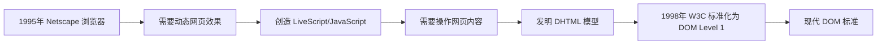

# DOM 基础技术文档

## 一、什么是 DOM？

### 1.1 官方定义

**DOM（Document Object Model，文档对象模型）** 是 HTML 和 XML 文档的编程接口。它提供了一种**结构化表示**文档的方式，使得程序可以**访问、修改、添加或删除**文档的内容、结构和样式。

### 1.2 通俗理解

想象 DOM 是网页的**"活地图"**或**"骨架模型"**：

- **地图比喻**：就像 Google 地图，你不仅可以查看地图，还可以标记位置、规划路线、修改地标
- **骨架比喻**：HTML 是骨架，DOM 是可编程的骨架，CSS 是皮肤，JavaScript 是肌肉和神经

### 1.3 DOM 的本质

```javascript
// 输入：HTML 源代码
<!DOCTYPE html>
<html>
  <body>
    <h1>标题</h1>
  </body>
</html>

// 输出：DOM 树
{
  type: "document",
  childNodes: [
    {
      type: "element",
      tagName: "html",
      childNodes: [
        {
          type: "element",
          tagName: "body",
          childNodes: [
            {
              type: "element",
              tagName: "h1",
              childNodes: [{ type: "text", value: "标题" }]
            }
          ]
        }
      ]
    }
  ]
}
```

## 二、DOM 从哪里来？

### 2.1 诞生背景



### 2.2 解析过程

```
1. 浏览器接收 HTML 字节流
   ↓ 网络传输
2. 解码为字符流
   ↓ HTML 解析器
3. 转换为令牌流（Tokens）
   ↓ 构建节点
4. 创建 DOM 树
   ↓ CSS 解析器
5. 创建 CSSOM 树
   ↓ 合并
6. 形成渲染树（Render Tree）
   ↓ 布局计算
7. 计算位置和大小
   ↓ 绘制
8. 显示在屏幕上
```

## 三、DOM 有什么用？

### 3.1 核心功能

#### 3.1.1 动态内容更新

```javascript
// 实时更新内容
function updateNews(news) {
  const newsElement = document.getElementById("news-feed");
  newsElement.innerHTML = `
        <h3>${news.title}</h3>
        <p>${news.content}</p>
        <span class="time">${new Date().toLocaleTimeString()}</span>
    `;
}

// 使用场景：新闻推送、聊天消息、实时数据展示
```

#### 3.1.2 用户交互响应

```javascript
// 处理各种用户交互
class InteractiveUI {
  constructor() {
    // 按钮点击
    document
      .querySelector(".submit-btn")
      .addEventListener("click", this.handleSubmit);

    // 表单输入
    document
      .querySelector("#search-input")
      .addEventListener("input", this.handleSearch);

    // 鼠标悬停
    document
      .querySelector(".tooltip")
      .addEventListener("mouseenter", this.showTooltip);
    document
      .querySelector(".tooltip")
      .addEventListener("mouseleave", this.hideTooltip);

    // 触摸事件
    document
      .querySelector(".swipe-area")
      .addEventListener("touchstart", this.handleTouch);

    // 键盘事件
    document.addEventListener("keydown", this.handleKeyboard);
  }

  handleSubmit = (event) => {
    event.preventDefault();
    // 提交表单逻辑
  };

  handleSearch = (event) => {
    // 实时搜索建议
    const query = event.target.value;
    this.showSuggestions(query);
  };
}
```

#### 3.1.3 样式动态控制

```javascript
// 根据条件改变样式
function updateTheme(theme) {
  const root = document.documentElement;

  switch (theme) {
    case "dark":
      root.style.setProperty("--bg-color", "#1a1a1a");
      root.style.setProperty("--text-color", "#ffffff");
      document.body.classList.add("dark-mode");
      break;
    case "light":
      root.style.setProperty("--bg-color", "#ffffff");
      root.style.setProperty("--text-color", "#000000");
      document.body.classList.remove("dark-mode");
      break;
    case "high-contrast":
      document.body.classList.add("high-contrast", "accessible");
      break;
  }
}

// 响应式布局调整
window.addEventListener("resize", () => {
  const width = window.innerWidth;
  const layout = document.querySelector(".layout");

  if (width < 768) {
    layout.classList.add("mobile");
    layout.classList.remove("desktop");
  } else {
    layout.classList.add("desktop");
    layout.classList.remove("mobile");
  }
});
```

#### 3.1.4 数据绑定与显示

```javascript
// 将数据绑定到 DOM
class DataRenderer {
  constructor(data) {
    this.data = data;
    this.container = document.querySelector(".data-container");
  }

  renderList() {
    this.container.innerHTML = "";

    this.data.forEach((item) => {
      const itemElement = document.createElement("div");
      itemElement.className = "data-item";
      itemElement.innerHTML = `
                <h4>${this.escapeHTML(item.name)}</h4>
                <p>${this.escapeHTML(item.description)}</p>
                <span class="price">$${item.price.toFixed(2)}</span>
                <button class="add-to-cart" data-id="${item.id}">
                    添加到购物车
                </button>
            `;
      this.container.appendChild(itemElement);
    });
  }

  escapeHTML(text) {
    const div = document.createElement("div");
    div.textContent = text;
    return div.innerHTML;
  }

  updateData(newData) {
    this.data = newData;
    this.renderList();
  }
}
```

#### 3.1.5 表单处理与验证

```javascript
// 完整的表单处理
class FormHandler {
  constructor(formId) {
    this.form = document.getElementById(formId);
    this.setupValidation();
    this.setupAutoSave();
  }

  setupValidation() {
    const inputs = this.form.querySelectorAll("[data-validation]");

    inputs.forEach((input) => {
      // 实时验证
      input.addEventListener("blur", () => this.validateField(input));
      input.addEventListener("input", () => this.clearError(input));

      // 粘贴验证
      input.addEventListener("paste", (e) => {
        setTimeout(() => this.validateField(input), 0);
      });
    });

    // 表单提交验证
    this.form.addEventListener("submit", (e) => {
      e.preventDefault();
      if (this.validateAll()) {
        this.submitForm();
      }
    });
  }

  setupAutoSave() {
    let saveTimer;

    this.form.addEventListener("input", () => {
      clearTimeout(saveTimer);
      saveTimer = setTimeout(() => {
        this.autoSave();
      }, 1000);
    });
  }

  validateField(field) {
    const value = field.value.trim();
    const rules = field.dataset.validation.split("|");

    for (const rule of rules) {
      if (!this.validateRule(value, rule)) {
        this.showError(field, rule);
        return false;
      }
    }

    this.showSuccess(field);
    return true;
  }

  validateAll() {
    let isValid = true;
    const fields = this.form.querySelectorAll("[data-validation]");

    fields.forEach((field) => {
      if (!this.validateField(field)) {
        isValid = false;
      }
    });

    return isValid;
  }
}
```

## 四、DOM 怎么用？

### 4.1 基础操作流程

```javascript
// DOM 操作四部曲
class DOMOperations {
  // 第一步：选择元素
  selectElements() {
    // 单元素选择
    const byId = document.getElementById("unique-id");
    const byQuery = document.querySelector(".class-name");
    const byTag = document.querySelector("div"); // 第一个 div

    // 多元素选择
    const allByClass = document.getElementsByClassName("item");
    const allByTag = document.getElementsByTagName("p");
    const allByQuery = document.querySelectorAll(".container > li");

    // 相对选择
    const parent = byId.parentElement;
    const children = byId.children;
    const nextSibling = byId.nextElementSibling;
    const prevSibling = byId.previousElementSibling;
  }

  // 第二步：修改元素
  modifyElements(element) {
    // 修改内容
    element.textContent = "纯文本内容";
    element.innerHTML = "<strong>HTML</strong> 内容";
    element.innerText = "考虑样式的文本";

    // 修改属性
    element.setAttribute("data-id", "123");
    element.id = "new-id";
    element.className = "class1 class2";
    element.classList.add("active");
    element.classList.remove("inactive");
    element.classList.toggle("visible");

    // 修改样式
    element.style.color = "red";
    element.style.backgroundColor = "#fff";
    element.style.fontSize = "16px";

    // 设置 dataset
    element.dataset.userId = "456";
    element.dataset.loaded = "true";
  }

  // 第三步：创建和添加元素
  createAndAdd() {
    // 创建新元素
    const newDiv = document.createElement("div");
    newDiv.textContent = "新元素";

    // 创建文本节点
    const textNode = document.createTextNode("纯文本");

    // 创建文档片段（性能优化）
    const fragment = document.createDocumentFragment();
    for (let i = 0; i < 100; i++) {
      const li = document.createElement("li");
      li.textContent = `项目 ${i}`;
      fragment.appendChild(li);
    }

    // 添加到 DOM
    const container = document.querySelector(".container");

    // 各种添加方式
    container.appendChild(newDiv); // 末尾添加
    container.prepend(newDiv); // 开头添加
    container.insertBefore(newDiv, reference); // 指定位置前
    container.replaceChild(newDiv, oldElement); // 替换
    newDiv.replaceWith(anotherElement); // 自身被替换
    newDiv.remove(); // 移除自身
  }

  // 第四步：事件处理
  setupEvents(element) {
    // 添加事件监听
    element.addEventListener("click", this.handleClick);
    element.addEventListener("mouseenter", this.handleMouseEnter);
    element.addEventListener("keydown", this.handleKeyDown);

    // 移除事件监听
    element.removeEventListener("click", this.handleClick);

    // 一次性事件
    element.addEventListener("click", this.handleOneTime, { once: true });

    // 被动事件（提高滚动性能）
    element.addEventListener("touchstart", this.handleTouch, { passive: true });
  }

  handleClick = (event) => {
    event.preventDefault(); // 阻止默认行为
    event.stopPropagation(); // 阻止事件冒泡

    console.log("事件目标:", event.target);
    console.log("当前元素:", event.currentTarget);
    console.log("事件类型:", event.type);
  };
}
```

### 4.2 实用代码模板

```javascript
// DOM 工具类
class DOMUtils {
  /**
   * 安全地设置 HTML 内容
   * @param {Element} element - 目标元素
   * @param {string} html - HTML 字符串
   */
  static setSafeHTML(element, html) {
    // 方法1：使用 textContent（防止 XSS）
    // element.textContent = html; // 不解析 HTML

    // 方法2：使用 innerHTML 但转义
    element.innerHTML = this.escapeHTML(html);

    // 方法3：创建元素并附加
    // const temp = document.createElement('div');
    // temp.textContent = html;
    // element.innerHTML = temp.innerHTML;
  }

  /**
   * 转义 HTML 特殊字符
   */
  static escapeHTML(text) {
    const div = document.createElement("div");
    div.textContent = text;
    return div.innerHTML;
  }

  /**
   * 创建元素并设置属性
   */
  static createElement(tag, attributes = {}, children = []) {
    const element = document.createElement(tag);

    // 设置属性
    Object.entries(attributes).forEach(([key, value]) => {
      if (key === "className") {
        element.className = value;
      } else if (key === "dataset") {
        Object.assign(element.dataset, value);
      } else if (key === "style") {
        Object.assign(element.style, value);
      } else if (key.startsWith("on") && typeof value === "function") {
        const eventName = key.substring(2).toLowerCase();
        element.addEventListener(eventName, value);
      } else {
        element.setAttribute(key, value);
      }
    });

    // 添加子元素
    children.forEach((child) => {
      if (typeof child === "string") {
        element.appendChild(document.createTextNode(child));
      } else if (child instanceof Node) {
        element.appendChild(child);
      }
    });

    return element;
  }

  /**
   * 批量更新样式
   */
  static setStyles(element, styles) {
    Object.assign(element.style, styles);
  }

  /**
   * 动画效果
   */
  static animate(element, keyframes, options = {}) {
    return element.animate(keyframes, {
      duration: 300,
      easing: "ease-in-out",
      fill: "forwards",
      ...options,
    });
  }

  /**
   * 懒加载图片
   */
  static lazyLoadImages() {
    const images = document.querySelectorAll("img[data-src]");

    const observer = new IntersectionObserver((entries) => {
      entries.forEach((entry) => {
        if (entry.isIntersecting) {
          const img = entry.target;
          img.src = img.dataset.src;
          img.removeAttribute("data-src");
          observer.unobserve(img);
        }
      });
    });

    images.forEach((img) => observer.observe(img));
  }

  /**
   * 防抖函数（优化频繁的 DOM 操作）
   */
  static debounce(func, wait) {
    let timeout;
    return function (...args) {
      clearTimeout(timeout);
      timeout = setTimeout(() => func.apply(this, args), wait);
    };
  }
}
```

## 五、应用场景示例

### 5.1 单页应用（SPA）

```javascript
class SinglePageApp {
  constructor() {
    this.currentPage = null;
    this.content = document.getElementById("app-content");
    this.setupNavigation();
    this.setupHistory();
  }

  setupNavigation() {
    // 拦截链接点击
    document.addEventListener("click", (e) => {
      const link = e.target.closest("a[data-spa]");
      if (link) {
        e.preventDefault();
        this.navigate(link.href);
      }
    });

    // 拦截表单提交
    document.addEventListener("submit", (e) => {
      const form = e.target.closest("form[data-spa]");
      if (form) {
        e.preventDefault();
        this.submitForm(form);
      }
    });
  }

  setupHistory() {
    // 处理浏览器前进后退
    window.addEventListener("popstate", (e) => {
      if (e.state && e.state.page) {
        this.loadPage(e.state.page);
      }
    });
  }

  async navigate(url) {
    // 解析 URL
    const path = new URL(url).pathname;

    // 显示加载状态
    this.showLoading();

    try {
      // 加载页面内容
      const content = await this.fetchPageContent(path);

      // 更新 DOM
      this.content.innerHTML = content;

      // 更新浏览器历史
      history.pushState({ page: path }, "", url);

      // 触发页面加载完成事件
      this.onPageLoad();
    } catch (error) {
      this.showError("页面加载失败");
    } finally {
      this.hideLoading();
    }
  }

  onPageLoad() {
    // 重新绑定新内容的事件
    this.bindDynamicEvents();

    // 滚动到顶部
    window.scrollTo(0, 0);

    // 更新页面标题
    const pageTitle = this.content.querySelector("h1");
    if (pageTitle) {
      document.title = `${pageTitle.textContent} - 我的应用`;
    }
  }
}
```

### 5.2 实时聊天系统

```javascript
class ChatSystem {
  constructor() {
    this.messagesContainer = document.querySelector(".chat-messages");
    this.input = document.querySelector(".chat-input");
    this.sendButton = document.querySelector(".send-button");
    this.messageCount = 0;

    this.setupEvents();
    this.setupWebSocket();
    this.setupAutoScroll();
  }

  setupEvents() {
    // 发送消息
    this.sendButton.addEventListener("click", () => this.sendMessage());
    this.input.addEventListener("keypress", (e) => {
      if (e.key === "Enter" && !e.shiftKey) {
        e.preventDefault();
        this.sendMessage();
      }
    });

    // 输入框自动调整高度
    this.input.addEventListener("input", () => {
      this.input.style.height = "auto";
      this.input.style.height = Math.min(this.input.scrollHeight, 150) + "px";
    });
  }

  setupWebSocket() {
    this.socket = new WebSocket("wss://chat.example.com");

    this.socket.addEventListener("message", (event) => {
      const message = JSON.parse(event.data);
      this.addMessage(message, false); // 接收的消息
    });

    this.socket.addEventListener("open", () => {
      this.showStatus("已连接");
    });

    this.socket.addEventListener("close", () => {
      this.showStatus("连接断开，正在重连...");
      setTimeout(() => this.setupWebSocket(), 3000);
    });
  }

  setupAutoScroll() {
    const observer = new MutationObserver(() => {
      this.scrollToBottom();
    });

    observer.observe(this.messagesContainer, {
      childList: true,
      subtree: true,
    });
  }

  addMessage(message, isOwn = true) {
    const messageId = `msg-${Date.now()}-${this.messageCount++}`;
    const messageElement = document.createElement("div");

    messageElement.className = `message ${isOwn ? "own" : "other"}`;
    messageElement.id = messageId;

    // 使用模板创建消息
    messageElement.innerHTML = `
            <div class="message-header">
                <span class="sender">${message.sender}</span>
                <span class="time">${this.formatTime(message.timestamp)}</span>
            </div>
            <div class="message-content">${this.escapeHTML(
              message.content
            )}</div>
            ${isOwn ? '<div class="status">发送中...</div>' : ""}
        `;

    // 添加到 DOM
    this.messagesContainer.appendChild(messageElement);

    // 如果是自己的消息，更新发送状态
    if (isOwn) {
      this.socket.send(JSON.stringify(message));

      // 模拟发送成功
      setTimeout(() => {
        const status = messageElement.querySelector(".status");
        if (status) {
          status.textContent = "已发送";
          status.classList.add("sent");
        }
      }, 1000);
    }

    return messageId;
  }

  scrollToBottom() {
    this.messagesContainer.scrollTop = this.messagesContainer.scrollHeight;
  }
}
```

### 5.3 数据可视化图表

```javascript
class DataChart {
  constructor(containerId, data) {
    this.container = document.getElementById(containerId);
    this.data = data;
    this.canvas = null;
    this.ctx = null;
    this.tooltip = null;

    this.init();
  }

  init() {
    // 创建画布
    this.canvas = document.createElement("canvas");
    this.canvas.width = this.container.clientWidth;
    this.canvas.height = this.container.clientHeight;
    this.container.appendChild(this.canvas);
    this.ctx = this.canvas.getContext("2d");

    // 创建工具提示
    this.tooltip = document.createElement("div");
    this.tooltip.className = "chart-tooltip";
    this.tooltip.style.cssText = `
            position: absolute;
            background: rgba(0,0,0,0.8);
            color: white;
            padding: 5px 10px;
            border-radius: 3px;
            pointer-events: none;
            opacity: 0;
            transition: opacity 0.2s;
            z-index: 1000;
        `;
    document.body.appendChild(this.tooltip);

    // 绑定事件
    this.bindEvents();

    // 绘制图表
    this.render();
  }

  bindEvents() {
    // 鼠标移动显示工具提示
    this.canvas.addEventListener("mousemove", (e) => {
      const rect = this.canvas.getBoundingClientRect();
      const x = e.clientX - rect.left;
      const y = e.clientY - rect.top;

      const dataPoint = this.findDataPoint(x, y);

      if (dataPoint) {
        this.showTooltip(e.clientX, e.clientY, dataPoint);
      } else {
        this.hideTooltip();
      }
    });

    // 点击交互
    this.canvas.addEventListener("click", (e) => {
      const rect = this.canvas.getBoundingClientRect();
      const x = e.clientX - rect.left;
      const y = e.clientY - rect.top;

      const dataPoint = this.findDataPoint(x, y);

      if (dataPoint) {
        this.onDataPointClick(dataPoint);
      }
    });

    // 窗口大小改变时重绘
    window.addEventListener("resize", () => {
      this.canvas.width = this.container.clientWidth;
      this.canvas.height = this.container.clientHeight;
      this.render();
    });
  }

  render() {
    // 清空画布
    this.ctx.clearRect(0, 0, this.canvas.width, this.canvas.height);

    // 绘制背景
    this.drawBackground();

    // 绘制坐标轴
    this.drawAxes();

    // 绘制数据
    this.drawDataPoints();

    // 绘制图例
    this.drawLegend();
  }

  showTooltip(x, y, data) {
    this.tooltip.innerHTML = `
            <strong>${data.label}</strong><br>
            值: ${data.value}<br>
            时间: ${data.time}
        `;

    this.tooltip.style.left = x + 10 + "px";
    this.tooltip.style.top = y + 10 + "px";
    this.tooltip.style.opacity = "1";
  }

  hideTooltip() {
    this.tooltip.style.opacity = "0";
  }
}
```

## 六、DOM 的优点和缺点

### 6.1 优点

#### 6.1.1 强大的动态性

```javascript
// 实时响应能力
class DynamicAdvantage {
  constructor() {
    // 1. 即时反馈
    document.querySelector(".rating").addEventListener("click", (e) => {
      const star = e.target.closest(".star");
      if (star) {
        // 立即更新 UI
        this.updateRating(star.dataset.value);
        this.showConfirmation();
        this.updateAverage();
      }
    });

    // 2. 无需页面刷新
    document.querySelector(".filter").addEventListener("change", (e) => {
      this.filterProducts(e.target.value);
      this.updateProductCount();
      this.updateURL();
      // 所有操作都在当前页面完成
    });

    // 3. 渐进式增强
    if ("IntersectionObserver" in window) {
      // 现代浏览器：懒加载
      this.lazyLoadImages();
    } else {
      // 旧浏览器：回退方案
      this.loadAllImages();
    }
  }
}
```

#### 6.1.2 标准化和跨浏览器

```javascript
// 一致的 API
class StandardizationAdvantage {
  constructor() {
    // 所有现代浏览器都支持
    const element = document.getElementById("test");

    // 标准方法在所有浏览器中工作方式相同
    element.addEventListener("click", () => {
      console.log("事件处理");
    });

    element.classList.add("active");

    // 选择器 API 标准化
    const items = document.querySelectorAll(".item:nth-child(2n)");

    // 现代 DOM 方法
    element.prepend(newElement); // 所有现代浏览器支持
    element.append(anotherElement);

    // 浏览器兼容性表
    const compatibility = {
      querySelectorAll: "IE8+",
      classList: "IE10+",
      dataset: "IE11+",
      append: "Chrome 54+, Firefox 49+",
      remove: "Chrome 23+, Firefox 23+",
    };
  }
}
```

#### 6.1.3 完整的事件系统

```javascript
// 丰富的事件处理
class EventSystemAdvantage {
  constructor() {
    // 1. 多种事件类型
    const events = [
      "click",
      "dblclick",
      "mousedown",
      "mouseup",
      "mouseenter",
      "mouseleave",
      "mousemove",
      "keydown",
      "keyup",
      "keypress",
      "focus",
      "blur",
      "change",
      "input",
      "submit",
      "reset",
      "load",
      "unload",
      "error",
      "resize",
      "scroll",
      "touchstart",
      "touchmove",
      "touchend",
      "dragstart",
      "drag",
      "dragend",
      "drop",
    ];

    // 2. 事件传播机制
    document.querySelector(".outer").addEventListener(
      "click",
      (e) => {
        console.log("捕获阶段: outer");
      },
      true
    ); // 捕获阶段

    document.querySelector(".inner").addEventListener("click", (e) => {
      console.log("目标阶段: inner");
    });

    document.querySelector(".outer").addEventListener("click", (e) => {
      console.log("冒泡阶段: outer");
    });

    // 3. 事件委托
    document.querySelector(".list").addEventListener("click", (e) => {
      if (e.target.matches(".delete-btn")) {
        this.deleteItem(e.target.closest(".item"));
      } else if (e.target.matches(".edit-btn")) {
        this.editItem(e.target.closest(".item"));
      }
    });

    // 4. 自定义事件
    const event = new CustomEvent("itemAdded", {
      detail: { item: newItem },
      bubbles: true,
    });
    document.dispatchEvent(event);
  }
}
```

#### 6.1.4 广泛的 API 支持

```javascript
// 丰富的内置功能
class APIAdvantage {
  constructor() {
    // 1. 选择器 API
    const complexSelectors = [
      "div:not(.exclude)",
      'input[type="checkbox"]:checked',
      "tr:nth-child(even)",
      'a[href^="https"]',
      ".modal:not(.hidden)",
    ];

    // 2. 样式操作
    const computedStyle = window.getComputedStyle(element);
    const animations = element.getAnimations();

    // 3. 表单 API
    const formData = new FormData(formElement);
    const validity = inputElement.validity;

    // 4. 历史 API
    history.pushState({ page: 1 }, "", "?page=1");
    history.replaceState({ page: 2 }, "", "?page=2");

    // 5. 存储 API
    localStorage.setItem("user", JSON.stringify(user));
    sessionStorage.setItem("token", token);

    // 6. 媒体 API
    const video = document.querySelector("video");
    video.play();
    video.pause();
    video.currentTime = 30;
  }
}
```

### 6.2 缺点

#### 6.2.1 性能问题

```javascript
class PerformanceIssues {
  constructor() {
    // 1. 重排（Reflow）和重绘（Repaint）
    // ❌ 不好的做法：多次操作触发多次重排
    element.style.width = "100px";
    element.style.height = "50px";
    element.style.margin = "10px";
    // 触发了3次重排

    // ✅ 好的做法：批量操作
    element.style.cssText = "width:100px; height:50px; margin:10px;";
    // 只触发1次重排

    // 2. 频繁的 DOM 查询
    // ❌ 不好的做法：在循环中查询 DOM
    for (let i = 0; i < 1000; i++) {
      const element = document.querySelector(".item"); // 每次都要查询
      element.style.left = i + "px";
    }

    // ✅ 好的做法：缓存 DOM 引用
    const element = document.querySelector(".item");
    for (let i = 0; i < 1000; i++) {
      element.style.left = i + "px";
    }

    // 3. 内存泄漏风险
    // ❌ 不好的做法：未清理的事件监听器
    function setup() {
      element.addEventListener("click", () => {
        console.log("clicked");
      });
    }
    // 多次调用 setup 会添加多个监听器

    // ✅ 好的做法：清理旧的监听器
    let currentHandler = null;
    function setup(handler) {
      if (currentHandler) {
        element.removeEventListener("click", currentHandler);
      }
      element.addEventListener("click", handler);
      currentHandler = handler;
    }
  }
}
```

#### 6.2.2 代码复杂度

```javascript
// 直接 DOM 操作容易导致代码混乱
class ComplexityExample {
  constructor() {
    // 一个复杂的 DOM 操作场景
    this.updateUserInterface = (user, settings, notifications) => {
      // 更新用户信息
      document.getElementById("username").textContent = user.name;
      document.getElementById("avatar").src = user.avatar;

      // 根据设置更新样式
      if (settings.theme === "dark") {
        document.body.classList.add("dark-mode");
        document.querySelector(".header").style.backgroundColor = "#333";
      }

      // 更新通知
      const notificationList = document.querySelector(".notifications");
      notificationList.innerHTML = "";
      notifications.forEach((notification) => {
        const item = document.createElement("li");
        item.className = notification.read ? "read" : "unread";
        item.innerHTML = `
                    <span class="type">${notification.type}</span>
                    <span class="message">${notification.message}</span>
                `;
        notificationList.appendChild(item);
      });

      // 更新状态指示器
      const statusIndicator = document.querySelector(".status");
      if (user.online) {
        statusIndicator.classList.add("online");
        statusIndicator.title = "在线";
      }

      // 更多操作...
      // 随着功能增加，代码变得越来越难以维护
    };
  }
}
```

#### 6.2.3 浏览器兼容性

```javascript
class CompatibilityIssues {
  constructor() {
    // 不同浏览器的差异
    const issues = {
      // 1. 事件处理差异
      eventHandler: () => {
        // IE8 及更早版本使用 attachEvent
        if (element.attachEvent) {
          element.attachEvent("onclick", handler);
        } else {
          element.addEventListener("click", handler);
        }
      },

      // 2. CSS 属性前缀
      cssPrefix: () => {
        const style = element.style;
        if ("transform" in style) {
          style.transform = "rotate(45deg)";
        } else if ("webkitTransform" in style) {
          style.webkitTransform = "rotate(45deg)";
        } else if ("msTransform" in style) {
          style.msTransform = "rotate(45deg)";
        }
      },

      // 3. API 支持差异
      apiSupport: () => {
        // 检查 API 是否可用
        if ("classList" in element) {
          element.classList.add("active");
        } else {
          element.className += " active";
        }

        if ("dataset" in element) {
          console.log(element.dataset.id);
        } else {
          console.log(element.getAttribute("data-id"));
        }
      },

      // 4. 事件对象差异
      eventObject: (event) => {
        // 获取事件目标
        const target = event.target || event.srcElement;

        // 阻止默认行为
        if (event.preventDefault) {
          event.preventDefault();
        } else {
          event.returnValue = false;
        }

        // 阻止事件冒泡
        if (event.stopPropagation) {
          event.stopPropagation();
        } else {
          event.cancelBubble = true;
        }
      },
    };
  }
}
```

#### 6.2.4 安全性风险

```javascript
class SecurityRisks {
  constructor() {
    // 1. XSS（跨站脚本攻击）
    this.dangerousExample = (userInput) => {
      // ❌ 危险：直接插入未经验证的 HTML
      document.getElementById("content").innerHTML = userInput;
      // 如果 userInput 是 '<script>恶意代码</script>'，脚本会执行

      // ✅ 安全：使用 textContent 或转义
      const element = document.getElementById("content");
      element.textContent = userInput; // 作为纯文本显示
      // 或使用转义函数
      element.innerHTML = this.escapeHTML(userInput);
    };

    // 2. 事件监听器注入
    this.eventInjection = (userCode) => {
      // ❌ 危险：eval 用户代码
      eval(userCode); // 用户可能注入恶意代码

      // ✅ 安全：使用安全的执行方式
      // 使用沙箱 iframe
      // 或使用 Function 构造函数但限制作用域
    };

    // 3. 属性操作风险
    this.attributeRisk = (userUrl) => {
      const link = document.createElement("a");
      // ❌ 危险：直接设置 href
      link.href = userUrl; // 可能是 javascript:alert('xss')

      // ✅ 安全：验证 URL
      if (this.isValidURL(userUrl)) {
        link.href = userUrl;
      } else {
        link.href = "#";
      }
    };

    // 4. 第三方脚本风险
    this.thirdPartyRisk = () => {
      // ❌ 危险：直接加载不受信任的脚本
      const script = document.createElement("script");
      script.src = "https://untrusted-site.com/script.js";
      document.head.appendChild(script);

      // ✅ 安全：使用 Subresource Integrity (SRI)
      script.integrity = "sha256-abc123...";
      script.crossOrigin = "anonymous";
    };
  }
}
```

## 七、关联技术拓展

### 7.1 虚拟 DOM

```javascript
// 虚拟 DOM 的基本实现
class VirtualDOM {
  constructor() {
    this.virtualTree = null;
    this.realTree = null;
  }

  // 创建虚拟节点
  createElement(tag, props, children) {
    return {
      tag,
      props: props || {},
      children: children || [],
      key: props && props.key,
      type: typeof tag === "function" ? "component" : "element",
    };
  }

  // 渲染虚拟节点到真实 DOM
  render(vnode, container) {
    if (typeof vnode === "string") {
      return document.createTextNode(vnode);
    }

    const element = document.createElement(vnode.tag);

    // 设置属性
    Object.entries(vnode.props).forEach(([key, value]) => {
      if (key.startsWith("on") && typeof value === "function") {
        const eventName = key.substring(2).toLowerCase();
        element.addEventListener(eventName, value);
      } else if (key === "className") {
        element.className = value;
      } else if (key === "style" && typeof value === "object") {
        Object.assign(element.style, value);
      } else {
        element.setAttribute(key, value);
      }
    });

    // 渲染子节点
    vnode.children.forEach((child) => {
      element.appendChild(this.render(child, element));
    });

    // 如果提供了容器，添加到容器中
    if (container) {
      container.appendChild(element);
    }

    return element;
  }

  // Diff 算法（简化版）
  diff(oldVNode, newVNode) {
    const patches = [];

    // 如果节点类型不同，直接替换
    if (oldVNode.tag !== newVNode.tag) {
      patches.push({ type: "REPLACE", newVNode });
      return patches;
    }

    // 比较属性
    const propsDiff = this.diffProps(oldVNode.props, newVNode.props);
    if (propsDiff.length > 0) {
      patches.push({ type: "PROPS", props: propsDiff });
    }

    // 比较子节点
    const childrenDiff = this.diffChildren(
      oldVNode.children,
      newVNode.children
    );
    if (childrenDiff.length > 0) {
      patches.push({ type: "CHILDREN", children: childrenDiff });
    }

    return patches;
  }

  // 应用差异到真实 DOM
  patch(element, patches) {
    patches.forEach((patch) => {
      switch (patch.type) {
        case "REPLACE":
          const newNode = this.render(patch.newVNode);
          element.parentNode.replaceChild(newNode, element);
          break;
        case "PROPS":
          Object.entries(patch.props).forEach(([key, value]) => {
            element.setAttribute(key, value);
          });
          break;
        case "CHILDREN":
          this.patchChildren(element, patch.children);
          break;
      }
    });
  }
}
```

### 7.2 Shadow DOM

```javascript
// Shadow DOM 示例
class WebComponent extends HTMLElement {
  constructor() {
    super();

    // 创建 Shadow DOM
    this.attachShadow({ mode: "open" });

    // 定义组件样式（封装在 Shadow DOM 中）
    const style = document.createElement("style");
    style.textContent = `
            :host {
                display: block;
                padding: 16px;
                border: 1px solid #ddd;
                border-radius: 4px;
            }
            
            .title {
                color: #333;
                font-size: 18px;
                margin-bottom: 8px;
            }
            
            .content {
                color: #666;
                line-height: 1.5;
            }
            
            ::slotted(button) {
                margin-top: 12px;
            }
        `;

    // 定义组件模板
    const template = document.createElement("template");
    template.innerHTML = `
            <div class="title">
                <slot name="title">默认标题</slot>
            </div>
            <div class="content">
                <slot>默认内容</slot>
            </div>
        `;

    // 将样式和模板添加到 Shadow DOM
    this.shadowRoot.appendChild(style);
    this.shadowRoot.appendChild(template.content.cloneNode(true));
  }

  // 生命周期回调
  connectedCallback() {
    console.log("组件已添加到 DOM");
    this.render();
  }

  disconnectedCallback() {
    console.log("组件已从 DOM 移除");
  }

  attributeChangedCallback(name, oldValue, newValue) {
    console.log(`属性 ${name} 从 ${oldValue} 变为 ${newValue}`);
    this.render();
  }

  static get observedAttributes() {
    return ["theme", "size"];
  }

  render() {
    const theme = this.getAttribute("theme") || "light";
    this.shadowRoot.host.setAttribute("data-theme", theme);
  }
}

// 注册自定义元素
customElements.define("my-component", WebComponent);
```

## 八、最佳实践总结

### 8.1 性能优化

```javascript
class DOMPerformance {
  // 1. 使用事件委托
  setupEventDelegation() {
    // ❌ 不好：为每个项目添加监听器
    document.querySelectorAll(".item").forEach((item) => {
      item.addEventListener("click", this.handleItemClick);
    });

    // ✅ 好：使用事件委托
    document.querySelector(".list").addEventListener("click", (event) => {
      if (event.target.matches(".item")) {
        this.handleItemClick(event);
      }
    });
  }

  // 2. 使用文档片段
  batchDOMOperations() {
    // ❌ 不好：多次直接操作 DOM
    for (let i = 0; i < 1000; i++) {
      const div = document.createElement("div");
      document.body.appendChild(div);
    }

    // ✅ 好：使用文档片段
    const fragment = document.createDocumentFragment();
    for (let i = 0; i < 1000; i++) {
      const div = document.createElement("div");
      fragment.appendChild(div);
    }
    document.body.appendChild(fragment);
  }

  // 3. 避免强制同步布局
  avoidForcedSynchronousLayout() {
    // ❌ 不好：读取后立即写入，导致强制布局
    const width = element.offsetWidth; // 读取
    element.style.width = width + 10 + "px"; // 写入

    // ✅ 好：批量读取和写入
    const reads = [element.offsetWidth, element.offsetHeight];

    // 批量写入
    element.style.width = reads[0] + 10 + "px";
    element.style.height = reads[1] + 10 + "px";
  }

  // 4. 使用 CSS 变换和动画
  useCSSTransforms() {
    // ❌ 不好：使用 JavaScript 动画
    let pos = 0;
    const animate = () => {
      pos++;
      element.style.left = pos + "px";
      if (pos < 100) requestAnimationFrame(animate);
    };

    // ✅ 好：使用 CSS 变换
    element.style.transition = "transform 0.3s ease";
    element.style.transform = "translateX(100px)";
  }
}
```

### 8.2 代码组织

```javascript
// 使用模块化组织 DOM 代码
class DOMManager {
  constructor() {
    this.elements = this.cacheElements();
    this.state = this.initState();
    this.bindEvents();
    this.initComponents();
  }

  // 缓存 DOM 引用
  cacheElements() {
    return {
      header: document.querySelector(".header"),
      sidebar: document.getElementById("sidebar"),
      content: document.querySelector(".main-content"),
      modal: document.querySelector(".modal"),
      form: document.querySelector("form"),
      buttons: {
        submit: document.querySelector(".submit-btn"),
        cancel: document.querySelector(".cancel-btn"),
        toggle: document.querySelector(".toggle-btn"),
      },
    };
  }

  // 初始化状态
  initState() {
    return {
      isModalOpen: false,
      currentTab: "home",
      userData: null,
      settings: {},
    };
  }

  // 绑定事件
  bindEvents() {
    // 使用事件委托
    this.elements.content.addEventListener("click", this.handleContentClick);

    // 绑定表单事件
    this.elements.form.addEventListener("submit", this.handleFormSubmit);

    // 绑定按钮事件
    Object.entries(this.elements.buttons).forEach(([name, button]) => {
      button.addEventListener(
        "click",
        this[`handle${this.capitalize(name)}Click`]
      );
    });

    // 绑定全局事件
    window.addEventListener("resize", this.handleResize);
    document.addEventListener("visibilitychange", this.handleVisibilityChange);
  }

  // 组件化
  initComponents() {
    this.components = {
      navigation: new Navigation(this.elements.header),
      sidebar: new Sidebar(this.elements.sidebar),
      modal: new Modal(this.elements.modal),
      form: new FormHandler(this.elements.form),
    };
  }
}
```

### 8.3 安全实践

```javascript
class DOMSecurity {
  // 1. 输入验证和转义
  sanitizeInput(input) {
    // 移除危险标签
    const dangerousTags = /<(script|iframe|object|embed)[^>]*>/gi;
    let sanitized = input.replace(dangerousTags, "");

    // 转义 HTML 实体
    const entityMap = {
      "&": "&amp;",
      "<": "&lt;",
      ">": "&gt;",
      '"': "&quot;",
      "'": "&#39;",
    };

    sanitized = sanitized.replace(/[&<>"']/g, (match) => entityMap[match]);

    return sanitized;
  }

  // 2. 安全的属性设置
  setSafeAttribute(element, attribute, value) {
    if (attribute === "href" || attribute === "src") {
      // 验证 URL
      if (this.isSafeURL(value)) {
        element.setAttribute(attribute, value);
      } else {
        console.warn("不安全的 URL:", value);
      }
    } else if (attribute.startsWith("on")) {
      // 禁止内联事件处理器
      console.error("不允许设置内联事件处理器");
    } else {
      element.setAttribute(attribute, value);
    }
  }

  // 3. 使用 Content Security Policy (CSP)
  setupCSP() {
    // 在服务器端设置 CSP 头
    // Content-Security-Policy:
    //   default-src 'self';
    //   script-src 'self' https://trusted-cdn.com;
    //   style-src 'self' 'unsafe-inline';
    //   img-src 'self' data: https:;
  }

  // 4. 防止点击劫持
  preventClickjacking() {
    // 设置 X-Frame-Options 头
    // X-Frame-Options: DENY
    // 或使用 frame-ancestors CSP 指令
    // Content-Security-Policy: frame-ancestors 'none';
  }
}
```

---

## 九、总结

### 9.1 DOM 的核心价值

1. **交互性**：使网页从静态文档变为动态应用
2. **标准化**：统一的 API 标准，跨浏览器兼容
3. **灵活性**：可以操作文档的每一个细节
4. **可访问性**：支持辅助技术和无障碍访问

### 9.2 学习建议

1. **理解原理**：不只是记住 API，要理解 DOM 树和事件机制
2. **实践为主**：通过实际项目掌握 DOM 操作
3. **关注性能**：学习性能优化技巧和最佳实践
4. **安全第一**：始终考虑安全性，防止 XSS 等攻击
5. **拥抱框架**：理解框架如何抽象 DOM，但也要懂底层原理

### 9.3 未来趋势

1. **Web Components**：原生组件化，更好的封装性
2. **性能优化**：更智能的渲染和更新机制
3. **TypeScript**：更强的类型安全
4. **框架演进**：React、Vue、Svelte 等框架继续发展
5. **新 API**：不断出现的新标准，如 ResizeObserver、IntersectionObserver

**记住**：DOM 是 Web 开发的基石，无论框架如何变化，理解 DOM 都是前端工程师的核心能力。
