<style lang=scss scop>
tr > td:nth-child(1) {
  white-space: nowrap;
}
</style>

# [ESLint](https://eslint.org) <Badge type="tip" text="^9.39.2" />

**Eslint9 主要变化**：

1. **新的[扁平化配置系统](/others/devtools/flat-config.md)**：从 `.eslintrc.*` 迁移到 `eslint.config.js`
2. **模块化配置**：ES 模块格式，支持导入/导出
3. **性能优化**：更快的配置解析和规则加载
4. **TypeScript 原生支持**：改进的 TypeScript 集成
5. **更简单的插件系统**：简化的插件定义和加载

## Eslint 是什么

ESLint 在现代前端开发流程中扮演着代码"健康检查官"的角色，它在整个开发周期的关键节点提供质量保障：

```mermaid
graph TD
    A[代码编写] --> B[ESLint检查]
    B --> C{问题类型}
    C -->|可自动修复| D[代码修复/优化]
    C -->|需要手动处理| E[开发者介入]
    D --> F[提交/构建]
    E --> F
    B -.-> G[实时反馈<br/>IDE集成]
    F -.-> H[持续集成<br/>CI/CD集成]

    style A fill:#e1f5fe
    style B fill:#fff3e0
    style F fill:#e8f5e8
    style G fill:#f3e5f5
    style H fill:#ffecb3
```



### 主要价值体现

#### 🎯 代码质量提升

- **错误预防**：在代码执行前发现语法错误、类型问题
- **潜在风险识别**：检测未使用变量、可能的逻辑错误、安全漏洞
- **最佳实践遵循**：引导开发者采用业界公认的最佳编码模式

#### 🏗️ 代码一致性保障

- **团队规范统一**：强制执行统一的编码风格（命名、格式、结构）
- **历史代码维护**：确保新旧代码遵循相同标准，降低技术债务
- **跨项目一致性**：在多个项目中复用配置，保持统一技术栈风格

#### ⚡ 开发效率优化

- **即时反馈**：IDE中实时显示问题，减少上下文切换
- **自动化修复**：一键修复常见问题，节省手动修改时间
- **减少调试时间**：提前发现潜在问题，避免运行时调试

#### 🤝 团队协作增强

- **降低Review成本**：自动处理风格问题，让Code Review聚焦逻辑和架构
- **新人快速上手**：统一规范帮助新成员快速适应项目代码风格
- **知识传承**：通过规则配置沉淀团队的最佳实践和经验

### 核心功能特性

| 特性              | 功能描述                                        | 实际应用场景                                    |
| ----------------- | ----------------------------------------------- | ----------------------------------------------- |
| **🔍 静态分析**   | 通过AST解析代码结构，不执行代码即可分析潜在问题 | 在CI/CD流水线中快速检查大规模代码库             |
| **⚙️ 规则系统**   | 300+内置规则 + 无限扩展能力，支持精细配置       | 根据项目阶段调整规则严格度（开发宽松/生产严格） |
| **🔧 自动修复**   | 安全地自动修复可预测的问题类型                  | 保存时自动修复分号、引号、缩进等格式问题        |
| **🧩 插件体系**   | 社区驱动的插件生态，支持框架特定规则            | Vue/React/Angular等框架的最佳实践检查           |
| **🎚️ 配置灵活**   | 支持全局、项目、目录、文件级别的规则覆盖        | 测试文件使用宽松规则，生产代码使用严格规则      |
| **🚀 现代化支持** | 原生支持ES6+/TypeScript/JSX等现代语法           | 直接检查TypeScript类型注解和装饰器语法          |

### 支持的开发生态

ESLint通过强大的扩展能力支持全栈JavaScript生态：

#### 📦 语言与框架

- **JavaScript全版本**：ES5、ES6(2015)到ESNext最新特性
- **TypeScript**：通过`@typescript-eslint`提供完整的TS语法检查
- **React/JSX**：检查JSX语法、Hook使用规则、组件最佳实践
- **Vue.js**：单文件组件模板检查、Vue 3 Composition API规则
- **Node.js**：CommonJS模块、全局变量、服务端最佳实践

#### 🔌 扩展能力

- **自定义解析器**：支持Babel、Flow等非标准语法
- **处理器支持**：可处理Markdown中的代码块、HTML中的脚本
- **共享配置**：发布和复用团队配置（如`eslint-config-airbnb`）
- **自定义规则**：编写项目特定规则，解决团队独特需求

#### 🔗 工具链集成

- **构建工具**：Webpack、Vite、Rollup插件
- **编辑器**：VS Code、WebStorm、Sublime、Vim/Neovim
- **版本控制**：Git Hooks、GitHub Actions、GitLab CI
- **项目管理**：与Jira、Linear等任务管理工具的报告集成

## ESLint 什么场景用

ESLint 的使用场景非常广泛，可以集成到开发流程的各个环节:

1. **Vue 项目中使用**：
   - 模板语法检查：检查 Vue 单文件组件中模板的语法和最佳实践
   - Vue 特定规则：验证组件命名、Props 定义、生命周期使用等 Vue 特性
   - 组合式 API 检查：确保 Vue 3 组合式 API 的正确使用
   - 与 Vetur/Volar 配合：在 Vue 开发工具中集成 ESLint 检查

2. **VS Code 中集成插件**：
   - 实时错误提示：编辑代码时即时显示问题，无需等待构建
   - 自动修复：保存时或手动触发自动修复可修复的问题
   - 悬浮提示：鼠标悬停显示规则说明和修复建议
   - 问题面板：集中查看当前文件的所有问题
   - 与 Prettier 协同：代码格式化与质量检查分离

3. **Git 提交时**：
   - 预提交钩子：在 commit 前自动检查，防止问题进入仓库
   - 增量检查：只检查变更文件，提高检查效率
   - 自动修复提交：修复后可自动重新提交
   - 提交信息规范：检查提交信息格式（需配合 commitlint）

4. **CI/CD 流水线中**：
   - 质量门禁：作为流水线的一环，阻止不达标代码合并
   - 自动化检查：每次提交或构建时自动运行
   - 报告生成：生成检查报告供分析和趋势跟踪
   - 多环境验证：确保开发、测试、生产环境规则一致
   - 与代码覆盖率结合：综合评估代码质量

5. 构建工具集成
   - Webpack：通过插件在构建过程中检查
   - Vite：开发服务器中实时检查
   - Rollup：构建流程中的质量检查
   - Babel：与转换过程结合检查

## ESLint9 怎么用

在本节我们展开说明 **在 Vue 中使用 Eslint** 以及 **在 Vscode 中集成 Eslint 插件**。

当我们使用 **Eslint9**时 ，创建配置文件 `eslint.config.js`后，二者都会使用同一套配置规则。

:::tip 对于VS Code的ESLint插件：

当你在VS Code中打开项目时，ESLint插件会查找项目中的ESLint配置文件

并根据这些配置来对代码进行实时检查，并在编辑器中显示错误和警告。
:::

::: tip 对于项目中的ESLint依赖：

当你在项目中运行ESLint脚本（`npm run lint`）时，ESLint依赖会使用同样的配置文件来检查代码。

此外，如果你在项目中配置了如vite-plugin-eslint这样的构建插件，它也会使用ESLint依赖并按照配置文件来检查代码。
:::

## 在 Vue 项目中使用

> To use ESLint, you must have Node.js (^18.18.0, ^20.9.0, or >=21.1.0) installed and built with SSL support.(If you are using an official Node.js distribution, SSL is always built in.)
>
> 要使用 ESLint，你必须安装满足版本要求的 Node.js（版本需为 ^18.18.0、^20.9.0 或 ≥21.1.0），且该 Node.js 需编译内置 SSL 支持。（若你使用的是 Node.js 官方发行版，则 SSL 功能始终为默认编译内置状态。）

### 安装 Eslint 依赖

使用初始化器来安装 `Eslint 9` ，执行命令：

```bash
# 当前版本为 @latest -> 9.39.2
npm init @eslint/config@latest
```

按照项目架构来选择相应配置:


完成配置后会 引入eslint相关依赖 并在项目根目录中生成 `eslint.config.js` 配置文件：

:::code-group

```js [eslint.config.js]
import js from "@eslint/js";
import globals from "globals";
import pluginVue from "eslint-plugin-vue";
import { defineConfig } from "eslint/config";

export default defineConfig([
  // 第一个配置对象：适用于所有JavaScript和Vue文件的基础规则
  {
    files: ["**/*.{js,mjs,cjs,vue}"], // 1. 文件匹配
    plugins: { js }, // 2. 加载插件
    extends: ["js/recommended"], // 3. 继承共享配置
    languageOptions: {
      // 4. 语言环境设置
      globals: globals.browser, // 4.1 指定全局变量
    },
  },
  // 第二个配置对象：专门为Vue文件添加的规则（来自vue插件）
  pluginVue.configs["flat/essential"], // 这是一个预定义的共享配置
]);
```

```json [package.json]
{
  "scripts": {
    "lint": "eslint .", // [!code hl]
    "lint:report": "eslint . --format json > eslint-report.json" // [!code hl]
  },
  "devDependencies": {
    "@eslint/js": "^9.39.2",
    "eslint": "^9.39.2",
    "eslint-plugin-vue": "^10.7.0",
    "globals": "^17.1.0"
  }
}
```

```js [test.js]
// 常见检查类型示例

//  未使用变量
const unusedVar = 42;

// 未声明变量
console.log(undeclaredVariable);

//  使用双等号
if ("1" == "2") {
}

//  对象重复键
const obj = {
  name: "Alice",
  name: "Bob",
};
//  常量条件
if (true) {
  console.log("always");
}
```

:::

### 使用 eslint 命令

执行 Eslint 命令进行代码检查：

```bash
# 检查项目文件，排除配置的忽略目录，默认排除 node_modules
npm run lint
# 生成 json 格式报告文件
npm run lint:report
```

执行后输出检查结果:


## 在 VS Code 中使用

在 VS Code 中集成 Eslint 插件后，可以在编辑代码时即时显示问题，无需手动执行 Eslint 命令。

### 安装 ESLint 插件

在 VSCode 扩展商店搜索 "ESLint"，安装由 Microsoft 提供的 ESLint 插件。


### 插件配置选项

我们可以在 Eslint 插件的 [GitHub](https://github.com/microsoft/vscode-eslint/blob/main/README.md) 主页查看插件配置选项，也可以在 插件市场 中查看：


在 VS Code 中根据你的需求选择配置 用户、工作区或项目级别的 `settings.json`：

::: code-group

```json [.vscode/settings.json]
// 常用配置选项 - 文件夹级别
{
  // 启用 ESLint
  "eslint.enable": true,

  // 为以下文件类型启用 ESLint
  "eslint.validate": [
    "javascript",
    "javascriptreact",
    "vue", // [!code hl]
    "typescript",
    "typescriptreact",
    "html"
  ]
}
```

```txt [ eslint 全部配置选项]
eslint.enable： 启用/禁用工作区文件夹的ESLint。默认情况下为启用状态。

eslint.debug： 启用ESLint的调试模式（与--debug命令行选项相同）。请查看ESLint输出通道以获取调试输出。此选项对于排查ESLint的配置和安装问题非常有帮助，因为它会提供有关ESLint如何验证文件的详细信息。

eslint.lintTask.enable： 扩展是否提供一个 lint 任务来检查整个工作区文件夹。

eslint.lintTask.options：运行用于检查整个工作区的任务时应用的命令行选项（https://eslint.org/docs/user-guide/command-line-interface）。指向自定义.eslintrc.json文件和自定义.eslintignore的示例如下：
{
  "eslint.lintTask.options": "-c C:/mydirectory/.eslintrc.json --ignore-path C:/mydirectory/.eslintignore ."
}

旧的eslint.packageManager设置现已弃用，可以安全地移除。它用于控制用于解析ESLint库的包管理器。这仅在全局解析ESLint库时才会产生影响。有效值为"npm"、"yarn"或"pnpm"。

eslint.options：用于配置如何使用ESLint类API或CLIEngine API启动ESLint的选项。如果使用的是ESLint 8或更高版本，或者使用的是ESLint 7且设置eslint.useESLintCLass为true，该扩展将使用ESLint类API。在所有其他情况下，将使用CLIEngine API。使用新的ESLint API指向自定义.eslintrc.json文件的示例如下：
{
  "eslint.options": { "overrideConfigFile": "C:/mydirectory/.eslintrc.json" }
}

请注意，如果你覆盖了配置文件的位置并使用相对路径，你可能还需要指定一个工作目录，以确保配置文件是相对于该目录来解析的。
使用旧版CLIEngine API指向自定义.eslintrc.json文件的示例如下：
{
  "eslint.options": { "configFile": "C:/mydirectory/.eslintrc.json" }
}

eslint.useESLintClass（@since 2.2.0）- 无论是否存在CLIEngine API，是否使用ESLint类API。此设置仅在使用ESLint 7.x版本时生效。

eslint.run - 运行代码检查工具，可选择onSave或onType，默认是onType。

eslint.quiet - 忽略警告，默认值为false。

eslint.runtime - 使用此设置来指定运行ESLint所使用的node运行时路径。如果想要使用系统默认版本的node，请使用"node"。
注意 若出现错误Unable to resolve your shell environment in a reasonable time.，可考虑增加application.shellEnvironmentResolutionTimeout中的超时时间。
注意 如果你正在使用远程连接（例如，WSL、远程SSH、开发容器等）并且不想修改工作区范围的设置，你需要通过命令面板运行“首选项：打开远程设置（JSON）”命令。在那里设置所需的选项，然后重新加载编辑器以确保代码检查器服务器应用这些更改。

eslint.execArgv - 使用此设置将额外参数传递给节点运行时，例如--max-old-space-size=4096
注意 如果你正在使用远程连接（例如，WSL、远程SSH、开发容器等）并且不想修改工作区范围的设置，你需要通过命令面板运行“首选项：打开远程设置（JSON）”命令。在那里设置所需的选项，然后重新加载编辑器以确保代码检查器服务器应用这些更改。

eslint.nodeEnv - 如果ESLint插件或配置需要定义process.env.NODE_ENV，请使用此设置。

eslint.nodePath - 如果无法检测到已安装的ESLint包，请使用此设置，例如/myGlobalNodePackages/node_modules。

eslint.probe - 一个语言标识符数组，ESLint 扩展应针对这些标识符激活并尝试验证文件。如果对探测到的语言的验证失败，扩展将保持静默。默认值为 ["astro", "civet", "javascript", "javascriptreact", "typescript", "typescriptreact", "html", "mdx", "vue", "markdown", "json", "jsonc"]。

eslint.validate - 一个语言标识符数组，用于指定要强制执行验证的文件。如果指定了该数组，则只有具有其中一个指定语言ID的文件才会被验证。这类似于--ext命令行选项。默认值为null。

eslint.format.enable：启用ESLint作为已验证文件的格式化工具。尽管你也可以通过设置editor.formatOnSave在保存时使用该格式化工具，但建议使用editor.codeActionsOnSave功能，因为它具有更好的可配置性。

eslint.workingDirectories - 指定ESLint所使用的工作目录的计算方式。ESLint会相对于工作目录解析配置文件（例如eslintrc、.eslintignore），因此正确配置此项十分重要。如果在终端中执行ESLint时需要将终端的工作目录切换到子文件夹，那么通常需要调整此设置（另请参见ESLint类选项#cwd）。还请记住，.eslintrc*文件会考虑父目录进行解析，而.eslintignore文件仅在当前工作目录中生效。可使用以下值：
[{ "mode": "location" }]（@since 2.0.0）：指示ESLint使用工作区文件夹位置或文件位置（如果没有打开工作区文件夹）作为工作目录。这是默认设置，与旧版本的ESLint扩展（1.9.x版本）中使用的策略相同。
[{ "mode": "auto" }]（@since 2.0.0）：指示ESLint根据package.json、eslint.config.js、.eslintignore和.eslintrc*文件的位置推断工作目录。这在许多情况下可能有效，但也可能导致意外结果。
string[]：要使用的工作目录数组。考虑以下目录结构：
root/
  client/
    .eslintrc.json
    client.js
  server/
    .eslintignore
    .eslintrc.json
    server.js
Then using the setting: 然后使用以下设置：
  "eslint.workingDirectories": [ "./client", "./server" ]
将以服务器目录作为当前eslint工作目录，验证服务器目录中的文件。客户端目录中的文件也是如此。ESLint扩展还会将进程的工作目录更改为提供的目录。如果不希望这样，可以使用带有!cwd属性的字面量（例如{ "directory": "./client", "!cwd": true }）。这将使用客户端目录作为ESLint工作目录，但不会更改进程的工作目录。
[{ "pattern": glob pattern }]（@自2.0.0起）：允许指定一个模式来检测工作目录。这基本上是列出每个目录的快捷方式。如果您有一个单体仓库，且所有项目都位于packages文件夹下，您可以使用{ "pattern": "./packages/*/" }来将所有这些文件夹设为工作目录。

eslint.codeAction.disableRuleComment - 包含以下属性的对象：
  enable - 在快速修复菜单中显示禁用 lint 规则。默认值为true。
  location - 选择在separateLine或sameLine添加eslint-disable注释。separateLine是默认设置。示例：

eslint.codeAction.showDocumentation - 具有以下属性的对象：
  enable - show open lint rule documentation web page in the quick fix menu. true by default.
  enable - 在快速修复菜单中显示打开的 lint 规则文档网页。默认值为 true。

eslint.codeActionsOnSave.mode（@始于2.0.12版本）- 控制在保存时运行代码操作时要修复哪些问题。
  all：通过重新验证文件内容来修复所有可能的问题。这会执行与在终端中使用--fix选项运行eslint相同的代码路径，因此可能需要一些时间。这是默认值。
  problems：仅修复当前已知的可修复问题，前提是它们的文本编辑不重叠。此模式速度快得多，但很可能只修复部分问题。
请注意，如果将eslint.codeActionsOnSave.mode设置为problems，则eslint.codeActionsOnSave.rules会被忽略。

eslint.codeActionsOnSave.rules（自2.2.0版本起可用）- 控制在保存时执行代码操作期间需要考虑的规则。如果未指定，则会考虑通过常规ESLint配置机制指定的所有规则。空数组表示不考虑任何规则。如果数组包含多个条目，则顺序很重要，第一个匹配项将决定规则的开启/关闭状态。此设置仅在以下情况下生效：
  eslint.codeActionsOnSave.mode 的值与 problems 不同
  所使用的ESLint版本要么是8或更高版本，要么是7.x版本且设置eslint.useESLintClass被设为true（版本 >= 8 ||（版本 == 7.x 且 eslint.useESLintClass））。
在这个示例中，只考虑与分号相关的规则：
"eslint.codeActionsOnSave.rules": [
  "*semi*"
]
此示例从保存时的代码操作中移除了所有TypeScript ESLint特定规则，但保留了所有其他规则：
"eslint.codeActionsOnSave.rules": [
  "!@typescript-eslint/*",
  "*"
]
此示例保留了TypeScript ESLint中的缩进和分号规则，禁用了所有其他TypeScript ESLint规则，并保留了其余规则：
"eslint.codeActionsOnSave.rules": [
    "@typescript-eslint/semi",
    "@typescript-eslint/indent",
    "!@typescript-eslint/*",
    "*"
]

eslint.rules.customizations（@since 2.1.20）- 强制规则在VS Code中报告与项目真实ESLint配置不同的严重性。包含以下属性：
  "rule": 选择名称匹配的规则，将星号视为通配符：{ "rule": "no-*", "severity": "warn" }
    在名称前加上"!"以定位所有与该名称不匹配的规则：{ "rule": "!no-*", "severity": "info" }
  "severity"：为匹配的规则设置新的严重性，"downgrade"其严重性，"upgrade"其严重性，或"default"为其原始严重性
  "fixable": Select only autofixable rules: { "rule": "no-*", "fixable": true, "severity": "info" }
  "fixable"：仅选择可自动修复的规则：{ "rule": "no-*", "fixable": true, "severity": "info" }
在这个示例中，所有规则都被覆盖为警告：
"eslint.rules.customizations": [
  { "rule": "*", "severity": "warn" }
]
在这个示例中，no-规则是提供信息的，其他规则被降级，并且"radix"重置为默认值：
"eslint.rules.customizations": [
  { "rule": "no-*", "severity": "info" },
  { "rule": "!no-*", "severity": "downgrade" },
  { "rule": "radix", "severity": "default" }
]
在本示例中，所有可自动修复的规则都被覆盖为信息级别：
"eslint.rules.customizations": [
  { "rule": "*", "fixable": true, "severity": "info" }
]

eslint.format.enable（@since 2.0.0）- 将ESLint用作经ESLint验证的文件的格式化工具。如果启用此功能，且希望将其设为默认格式化工具，请确保禁用其他格式化工具。实现此目的的一个好方法是，为JavaScript添加以下设置："[javascript]": { "editor.defaultFormatter": "dbaeumer.vscode-eslint" }。对于TypeScript，则需要添加："[typescript]": { "editor.defaultFormatter": "dbaeumer.vscode-eslint" }。

eslint.onIgnoredFiles（@since 2.0.10）：用于控制在尝试检查被忽略的文件时是否应生成警告。默认值为off。可以设置为warn。

editor.codeActionsOnSave（@since 2.0.0）：此设置现在支持条目source.fixAll.eslint。如果设置为true，所有插件中所有可自动修复的ESLint错误都将在保存时被修复。你还可以使用VS Code的语言范围设置有选择地启用和禁用特定语言。要为HTML文件禁用codeActionsOnSave</b2，请使用以下设置：
"[html]": {
  "editor.codeActionsOnSave": {
    "source.fixAll.eslint": false
  }
}
旧的eslint.autoFixOnSave设置现已弃用，可以安全地移除。另请注意，如果您将ESLint用作默认格式化程序，那么在开启editor.codeActionsOnSave时，应该关闭editor.formatOnSave。否则，您的文件会被修复两次，这是不必要的。

eslint.problems.shortenToSingleLine：（@since 2.3.0）- 将下划线标注问题的文本范围缩短至其首个相关行。

eslint.experimental.useFlatConfig：（@since 2.3.0）- 启用对实验性Flat Config（即eslint.config.js，受ESLint 8.21或更高版本支持）的支持

eslint.timeBudget.onValidation（自2.3.5版本起）- 控制在显示警告或错误之前可用于验证的时间预算。

eslint.timeBudget.onFixes（@since 2.3.5）- 控制在显示警告或错误之前可用于计算修复的时间预算。


```

:::

完成配置后，编码开发时即可高亮提示错误：


---

**开发时**：VS Code ESLint 插件使用配置提供实时反馈

**构建/检查时**：项目中的 ESLint 依赖使用配置进行代码检查

**两者同步**：保持相同的规则集，确保编辑器提示和命令行结果一致

## [Eslint 配置项](https://eslint.org/docs/latest/use/configure/)

除了上面用到的，一个完整的ESLint 9配置还可以包含以下核心模块：

| 模块                                | 作用                                                                                                  | 示例                                                                                      |
| :---------------------------------- | :---------------------------------------------------------------------------------------------------- | :---------------------------------------------------------------------------------------- |
| **`rules`**                         | **核心**：定义具体的代码检查规则及其错误级别。                                                        | `{ “no-console”: “warn”, “semi”: [“error”, “always”] }`                                   |
| **`ignores`**                       | **忽略文件**：在配置内部声明要忽略的文件或目录，替代外部的 `.eslintignore` 文件。**需放在数组首位**。 | `{ ignores: [“dist/”, “**/*.test.js”] }`                                                  |
| **`languageOptions.parser`**        | **自定义解析器**：指定解析代码的解析器（如 `@babel/eslint-parser`、`@typescript-eslint/parser`）。    | `{ languageOptions: { parser: tsParser } }`                                               |
| **`languageOptions.parserOptions`** | **解析器选项**：传递给解析器的额外选项（如ECMAScript版本、JSX支持）。                                 | `{ languageOptions: { parserOptions: { ecmaVersion: “latest”, sourceType: “module” } } }` |
| **`languageOptions.globals`**       | **全局变量**（已见上文）：声明额外的全局变量，避免被 `no-undef` 规则报错。                            | `{ languageOptions: { globals: { jQuery: “readonly” } } }`                                |
| **`settings`**                      | **共享设置**：提供给插件使用的配置信息，插件之间可以共享。                                            | `{ settings: { react: { version: “18.2” } } }`                                            |

## 总结与延伸

ESLint 9不仅是一个“挑错”工具，更是通过一套可团队共享、高度定制的规则，将代码质量保障、风格统一和最佳实践深度融入到从编码、提交到集成的整个开发生命周期中。

从 Vue 组件的特性检查，到 VS Code 中的实时反馈，再到 CI/CD 流水线中的质量门禁，ESLint 正从多维度守护着项目的健康度。

掌握并应用好 ESLint 9，意味着你的代码库将拥有更强的可维护性、更少的运行时错误和更顺畅的团队协作体验。

在实际开发中，我们经常同时使用 ESLint 和 [Prettier](/others/devtools/prettier.md)。它们职责明确，相辅相成：

- ESLint：负责 代码质量检查（如未使用的变量、可能的错误）和 代码风格中与逻辑相关的部分（如引号类型、分号、代码格式）。

- Prettier：是一个代码格式化工具，专注于代码外观（如行长、缩进、空格、换行），并强制实施一套完全一致的风格
