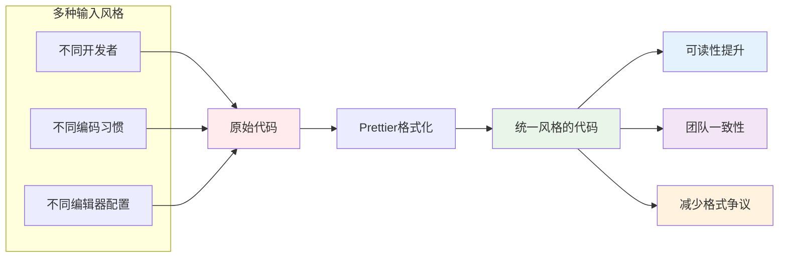

# [Prettier](https://prettier.io) <Badge type="tip" text="^3.8.1" />

> Prettier is an opinionated code formatter. It enforces a consistent style by parsing your code and re-printing it with its own rules that take the maximum line length into account, wrapping code when necessary.
>
> Prettier 是一款具有强制性风格倾向的代码格式化工具。它会对代码进行解析，再依据自身规则重新排版输出 —— 这些规则会预先考虑最大行长度限制，并在需要时自动对代码进行换行处理，以此保证代码风格的一致性。

## Prettier 是什么

Prettier 是现代前端开发的"代码美容师"，专注于代码的**格式化**而非逻辑检查。它在开发流程中确保无论谁编写代码，输出结果在风格上都完全一致：



### 主要价值体现

#### 🎨 代码风格一致性

- **消除风格争议**：团队不再争论缩进、分号、引号等问题
- **历史代码统一**：一键格式化整个代码库，新旧代码风格一致
- **多项目统一**：跨项目共享配置，保持相同代码风格

#### ⚡ 开发效率提升

- **零决策成本**：无需思考代码格式，专注于业务逻辑
- **自动修复**：保存时自动格式化，无需手动调整
- **减少代码审查时间**：代码审查聚焦逻辑而非风格

#### 🔧 维护性增强

- **清晰的版本对比**：格式统一后，Git差异只显示实际变更
- **新人友好**：新成员无需学习项目特定格式规则
- **工具链整合**：与编辑器、Git钩子、CI/CD无缝集成

### 核心格式化特性

| 特性            | 功能描述                       | 实际应用场景                               |
| :-------------- | :----------------------------- | :----------------------------------------- |
| **📏 行宽控制** | 自动换行，保持代码在指定宽度内 | 保持代码在80/100/120字符宽度内，提高可读性 |
| **💅 代码美化** | 统一的缩进、空格、换行格式     | 对象、数组、函数参数等的一致格式化         |
| **🔠 引号转换** | 统一使用单引号或双引号         | 整个项目引号风格一致                       |
| **🔢 分号处理** | 统一添加或省略分号             | 根据配置决定语句末尾是否带分号             |
| **📐 括号空格** | 控制括号内侧的空格             | 函数参数、对象字面量的一致空格处理         |
| **↔️ 尾随逗号** | 控制对象、数组等的尾随逗号     | 多行结构中保持一致的逗号使用               |

### 支持的语言与文件

Prettier 支持广泛的现代开发语言和文件格式：

#### 📦 主要支持的语言

- **JavaScript/TypeScript**：ES5到ESNext，包括JSX/TSX
- **CSS/SCSS/Less**：样式表格式化
- **HTML/XML/Vue**：标记语言格式化（Vue单文件组件）
- **JSON/GraphQL**：数据查询和配置文件
- **Markdown/MDX**：文档格式化
- **YAML/TOML**：配置文件格式化

#### 🔌 编辑器集成

- **VS Code**：深度集成，保存时自动格式化
- **WebStorm/IntelliJ**：内置支持或通过插件
- **Sublime Text**：通过插件支持
- **Vim/Neovim**：通过插件支持
- **Atom**：通过插件支持

#### 🔗 构建工具集成

- **作为脚本**：通过npm脚本运行
- **Git钩子**：通过lint-staged在提交前格式化
- **CI/CD**：在流水线中检查格式
- **与ESLint配合**：通过eslint-config-prettier避免规则冲突

## Prettier 怎么用

在本节我们展开说明 **在 Vue 中使用 Prettier** 以及 **在 Vscode 中集成 Prettier 插件**。

Prettier 在这方面的工作机制与 ESLint 非常相似，同样遵循“一次配置，多处生效”的原则。

当我们使用 **Prettier**时 ，创建配置文件 `.prettierrc`后，二者都会使用同一套配置规则。

:::tip 对于VS Code的 Prettier 插件：

在 VS Code 中使用 Prettier 插件时，插件会自动向上查找工作区内离文件最近的 Prettier 配置文件。

理想情况下，插件会使用与命令行完全相同的项目配置。
:::

::: tip 对于项目中的 Prettier 依赖：

当你在项目中运行Prettier脚本（`npm run prettier`）时，自动查找项目根目录的 Prettier 配置文件（如 prettier.config.js），使用项目配置格式化文件。
:::
虽然原理相似，但在 VS Code 集成上有一个重要区别，需要特别关注：

1. 配置查找的优先级与潜在冲突
   - Prettier VS Code 插件在激活时，会按照一套优先级顺序来查找并确定使用哪份配置。
   - 如果项目中没有Prettier配置文件，编辑器将回退到使用工作区或用户设置，这可能导致团队成员间或与CI环境产生不一致的格式化结果。
2. 确保一致性的最佳实践
   - 项目必须包含配置文件：在项目根目录创建 prettier.config.js 或 .prettierrc，这是“单一可信源”。
   - 禁用VS Code的无关格式化：在项目的 .vscode/settings.json 中，明确设置 "editor.defaultFormatter": "esbenp.prettier-vscode"，并关闭其他格式化器（如 VS Code 自带的 HTML、CSS 格式化），防止它们干扰。
   - 要求插件读取项目配置：可以设置 "prettier.requireConfig": true，这样如果没有找到项目配置，插件会提示而不会使用其他默认规则。

## 在 Vue 项目中使用

### 安装Prettier依赖

1. 本地安装prettier：

```bash
npm install --save-dev --save-exact prettier
```

2. 创建一个空的配置文件让编辑器以及其他工具知道你正在使用 Prettier

```bash
node --eval "fs.writeFileSync('.prettierrc','{}\n')"
```

3. 创建 `.prettierignore`文件告诉Prettier 客户端知道哪些文件不需要格式化，例如：

```bash
node --eval "fs.writeFileSync('.prettierignore','# Ignore artifacts:\nbuild\ncoverage\n')"
```

Prettier 有内置的默认配置，当没有找到相关配置文件时，会使用这些默认规则：
:::code-group

```json [.prettierrc]
{
  "printWidth": 80, // 每行最大80字符
  "tabWidth": 2, // 缩进2个空格
  "useTabs": false, // 使用空格，而不是Tab
  "semi": true, // 语句末尾添加分号
  "singleQuote": false, // 使用双引号（默认）
  "quoteProps": "as-needed", // 仅在必需时给对象属性加引号
  "jsxSingleQuote": false, // JSX中使用双引号
  "trailingComma": "none", // 没有尾随逗号
  "bracketSpacing": true, // 对象括号间有空格：{ foo: bar }
  "bracketSameLine": false, // JSX标签的>单独一行
  "arrowParens": "always", // 箭头函数参数始终有括号：(x) => x
  "endOfLine": "lf", // 使用LF换行符
  "embeddedLanguageFormatting": "auto" // 自动格式化嵌入的代码
}
```

```txt [.prettierignore]
# 默认忽略
node_modules/
.git/
.svn/
.hg/
package-lock.json
yarn.lock
pnpm-lock.yaml
dist/
build/
coverage/
```

:::

### 运行 prettier 指令

在 `package.json`中添加 prettier 指令

```json
{
  "scripts": {
    "format": "prettier --write .",
    "format:check": "prettier --check ."
  },
  "devDependencies": {
    "prettier": "3.8.1"
  }
}
```

现有风格未统一的代码片段，执行Eslint 命令对代码检查 `npm run format:check`：


执行Eslint 命令对代码格式化 `npm run format`：


## 在 VS Code 中使用

在 VS Code 中集成 Prettier 插件后，可配置保存文件后使用 Prettier 自动格式化代码，无需手动执行 Prettier 命令。

### 安装 Prettier 插件

在 VS Code 扩展商店搜索 "Prettier"，安装 Prettier 官方插件：


在插件市场中的 prettier 主页中，我们可以看到：

> **Default Formatter**
>
> To ensure that this extension is used over other extensions you may have installed, be sure to set it as the default formatter in your VS Code settings. This setting can be set for all languages or by a specific language.
>
> 为确保优先使用此扩展而非其他已安装的扩展，请在VS Code设置中将其设为默认格式化工具。该设置可针对所有编程语言全局生效，亦可为特定语言单独配置。
>
> ```json
> {
>   "editor.defaultFormatter": "esbenp.prettier-vscode",
>   "[javascript]": {
>     "editor.defaultFormatter": "esbenp.prettier-vscode"
>   }
> }
> ```

> **Format On Save**
>
> Respects editor.formatOnSave setting.
>
> You can turn on format-on-save on a per-language basis by scoping the setting:
>
> 你可以通过限定设置的作用域，针对特定编程语言开启保存时格式化功能。
>
> ```json
> {
>   // 全局关闭编辑器保存时格式化代码
>   "editor.formatOnSave": false,
>   // 对于 javascript 开启保存时格式化代码
>   "[javascript]": {
>     "editor.formatOnSave": true
>   }
> }
> ```

### 配置 Prettier 插件

考虑到：

1. **避免不必要的格式化**：

   有些文件类型你可能不希望自动格式化：
   - JSON、YAML：可能包含敏感的空格/格式
   - Markdown：有时需要保留特定的换行
   - 配置文件：某些配置文件对格式敏感
   - 二进制文件：不应该被格式化
   - 引入不必要的 diff（git 变更）

2. **性能考虑**：

   如果对所有文件都启用自动格式化：
   - 保存大型非代码文件时会有延迟
   - 每次保存都会触发 Prettier 检查，可能影响编辑器性能
   - 对于不需要格式化的文件，这是不必要的开销

3. **多格式化工具共存**：

   你可能需要不同的格式化工具处理不同语言，如果全局启用，可能造成冲突或不一致。
   - JavaScript/TypeScript：用 Prettier
   - Python：用 Black 或 autopep8
   - Go：用 gofmt
   - Java：用 Eclipse Formatter

推荐配置是针对特定语言启用formatOnSave，而不是全局启用：

```json [.vscode/settings.json]
// 文件夹级别设置
{
  // 全局关闭，避免不必要的格式化
  "editor.formatOnSave": false,

  // 只在支持的语言中启用
  "[javascript]": {
    "editor.formatOnSave": true,
    "editor.defaultFormatter": "esbenp.prettier-vscode"
  },
  "[vue]": {
    "editor.formatOnSave": true,
    "editor.defaultFormatter": "esbenp.prettier-vscode"
  }
  // ...其他需要配置的语言
}
```

## Prettier 配置项

Prettier 配置主要分为以下几个核心模块：

1. **基本格式化规则**：控制代码布局的基础规则，如缩进、行宽等
2. **引号与符号**：控制字符串引号、分号、逗号等符号的使用
3. **特定语法处理**：针对特定语法（如JSX、Vue、TypeScript）的格式化规则
4. **文件与路径**：控制文件处理、忽略规则等
5. **编辑器与工具集成**：与编辑器、构建工具的集成配置

### 基本格式化

| 配置项            | 类型                            | 默认值  | 说明                              | 推荐设置                            |
| ----------------- | ------------------------------- | ------- | --------------------------------- | ----------------------------------- |
| **printWidth**    | `number`                        | `80`    | 每行代码的最大宽度（字符数）      | `100` (现代项目)                    |
| **tabWidth**      | `number`                        | `2`     | 每个缩进级别的空格数              | `2` (Vue/React) 或 `4` (企业级)     |
| **useTabs**       | `boolean`                       | `false` | 使用制表符（Tab）代替空格         | `false` (推荐空格)                  |
| **endOfLine**     | `"lf"` `"crlf"` `"cr"` `"auto"` | `"lf"`  | 行结束符                          | `"lf"` (Unix) 或 `"crlf"` (Windows) |
| **insertPragma**  | `boolean`                       | `false` | 在文件顶部插入 `@format` 特殊注释 | `false`                             |
| **requirePragma** | `boolean`                       | `false` | 只格式化带有 `@format` 注释的文件 | `false`                             |

### 引号与符号

| 配置项              | 类型                                      | 默认值        | 说明                                          | 推荐设置                                |
| ------------------- | ----------------------------------------- | ------------- | --------------------------------------------- | --------------------------------------- |
| **singleQuote**     | `boolean`                                 | `false`       | 使用单引号代替双引号                          | `true` (主流)                           |
| **jsxSingleQuote**  | `boolean`                                 | `false`       | 在 JSX 中使用单引号                           | `false` (保持与 HTML 一致)              |
| **quoteProps**      | `"as-needed"` `"consistent"` `"preserve"` | `"as-needed"` | 对象属性的引号处理                            | `"as-needed"`                           |
| **trailingComma**   | `"none"` `"es5"` `"all"`                  | `"es5"`       | 在多行结构的最后一项添加尾随逗号              | `"es5"` 或 `"all"`                      |
| **semi**            | `boolean`                                 | `true`        | 在语句末尾添加分号                            | `true` (减少错误) 或 `false` (现代风格) |
| **bracketSpacing**  | `boolean`                                 | `true`        | 对象字面量的大括号间添加空格                  | `true`                                  |
| **arrowParens**     | `"always"` `"avoid"`                      | `"always"`    | 箭头函数参数添加括号                          | `"always"` (清晰) 或 `"avoid"` (简洁)   |
| **bracketSameLine** | `boolean`                                 | `false`       | 将多行 HTML/JSX 元素的 `>` 放在最后一行的末尾 | `false` (React) 或 `true` (Vue)         |

### 特定语法处理

| 配置项                        | 类型                                      | 默认值   | 说明                                        | 推荐设置 |
| ----------------------------- | ----------------------------------------- | -------- | ------------------------------------------- | -------- |
| **htmlWhitespaceSensitivity** | `"css"` `"strict"` `"ignore"`             | `"css"`  | HTML 文件的空格敏感度                       | `"css"`  |
| **vueIndentScriptAndStyle**   | `boolean`                                 | `false`  | Vue 文件中缩进 `<script>` 和 `<style>` 标签 | `false`  |
| **jsxBracketSameLine**        | `boolean`                                 | `false`  | 已弃用，请使用 `bracketSameLine`            | -        |
| **jsxClosingTagLocation**     | `"auto"` `"tag-aligned"` `"line-aligned"` | `"auto"` | JSX 闭合标签的位置                          | `"auto"` |

### 布局与换行

| 配置项                         | 类型                              | 默认值       | 说明                       | 推荐设置                        |
| ------------------------------ | --------------------------------- | ------------ | -------------------------- | ------------------------------- |
| **proseWrap**                  | `"always"` `"never"` `"preserve"` | `"preserve"` | 散文（Markdown）的换行方式 | `"always"`                      |
| **embeddedLanguageFormatting** | `"auto"` `"off"`                  | `"auto"`     | 是否格式化嵌入式代码       | `"auto"`                        |
| **singleAttributePerLine**     | `boolean`                         | `false`      | 每个属性单独一行           | `false` (Vue 模板可设为 `true`) |

## 最佳实践

1. **渐进式配置**: 先从基础配置开始，逐步添加复杂规则
2. **版本控制**: 将配置文件纳入版本控制
3. **团队评审**: 新配置需团队评审通过
4. **文档说明**: 在配置文件中添加注释说明
5. **定期更新**: 随着 Prettier 版本更新调整配置

| 类别         | 主要配置项                                  | 影响范围       |
| ------------ | ------------------------------------------- | -------------- |
| **布局控制** | `printWidth`, `tabWidth`, `useTabs`         | 代码整体布局   |
| **符号处理** | `singleQuote`, `semi`, `trailingComma`      | 语法符号使用   |
| **空格处理** | `bracketSpacing`, `arrowParens`             | 空格和空行     |
| **特定语法** | `vueIndentScriptAndStyle`, `jsxSingleQuote` | 框架特定规则   |
| **文件处理** | `endOfLine`, `requirePragma`                | 文件级控制     |
| **覆盖规则** | `overrides`                                 | 文件类型差异化 |

:::code-group

```json [配置项说明]
{
  // Vue 特性优化配置
  "vueIndentScriptAndStyle": true, // Vue 文件中缩进 <script> 和 <style>
  "bracketSameLine": true, // Vue 模板中 > 放在行尾（更紧凑）
  "singleAttributePerLine": true, // Vue 模板中每个属性单独一行
  "htmlWhitespaceSensitivity": "ignore", // Vue 模板中忽略空格敏感度

  // TypeScript 支持优化
  "trailingComma": "all", // TypeScript 类型定义需要尾逗号
  "arrowParens": "always", // TypeScript 泛型函数需要括号
  "bracketSpacing": true, // TypeScript 泛型更好看

  // 现代 JavaScript/TypeScript 风格
  "singleQuote": true, // 现代 JS/TS 社区标准
  "printWidth": 100, // 现代宽屏显示器适配
  "semi": true // TypeScript 建议使用分号
}
```

```json [完整.prettierrc]
{
  // ========== 基础配置 ==========

  // 1. JSON Schema 验证（可选，但推荐）
  // 为VS Code等编辑器提供智能提示和自动补全
  "$schema": "https://json.schemastore.org/prettierrc",

  // 2. 行宽设置
  // 默认80，现代项目建议100-120，适应宽屏显示器
  "printWidth": 100,

  // 3. 缩进设置
  "tabWidth": 2, // 缩进空格数：2（Vue/React社区标准）或4（企业级）
  "useTabs": false, // 使用空格而非Tab键缩进，确保跨编辑器一致性

  // ========== 语法符号配置 ==========

  // 4. 分号设置
  "semi": true, // 语句末尾添加分号，减少JavaScript自动分号插入问题

  // 5. 引号设置
  "singleQuote": true, // 使用单引号：更简洁，现代JS/TS社区标准
  "quoteProps": "as-needed", // 对象属性引号：仅在必需时添加
  "jsxSingleQuote": false, // JSX中保持双引号，与HTML标准一致

  // 6. 逗号设置
  "trailingComma": "all", // 所有多行结构的尾随逗号，减少Git差异

  // ========== 空格与布局配置 ==========

  // 7. 括号空格
  "bracketSpacing": true, // 对象字面量大括号间添加空格：{ foo: bar }

  // 8. 括号换行（Vue3优化关键）
  "bracketSameLine": true, // Vue模板中>放在行尾，使模板更紧凑

  // 9. 箭头函数参数括号
  "arrowParens": "always", // 箭头函数参数始终有括号：(x) => x，提高可读性

  // ========== 格式化范围控制 ==========

  // 10. 格式化范围（高级功能）
  "rangeStart": 0, // 从第0个字符开始格式化
  "rangeEnd": Infinity, // 格式化到文件末尾

  // 11. 特殊注释控制
  "requirePragma": false, // 不需要@format注释即可格式化
  "insertPragma": false, // 不自动插入@format注释

  // ========== 特定文件类型处理 ==========

  // 12. Markdown换行处理
  "proseWrap": "preserve", // 保持Markdown原有换行

  // 13. HTML空格敏感度
  "htmlWhitespaceSensitivity": "css", // 根据CSS显示规则处理HTML空格

  // 14. Vue3特定优化（重要！）
  "vueIndentScriptAndStyle": true, // Vue单文件组件中缩进<script>和<style>

  // 15. 行结束符（跨平台一致性）
  "endOfLine": "lf", // Unix/Linux/MacOS标准，Git默认转换

  // 16. 嵌入式代码格式化
  "embeddedLanguageFormatting": "auto", // 自动格式化HTML/CSS中的JS代码

  // 17. 单行属性（Vue模板优化）
  "singleAttributePerLine": false, // 默认不强制单行属性

  // ========== 文件类型覆盖规则 ==========
  // 针对不同文件类型应用特定配置

  "overrides": [
    // 1. Vue/HTML文件特殊处理
    {
      "files": ["*.vue", "*.html"],
      "options": {
        "parser": "vue", // 使用Vue专用解析器
        "printWidth": 100, // 保持一致的打印宽度
        "singleAttributePerLine": true, // Vue模板中每个属性单独一行，提高可读性
        "htmlWhitespaceSensitivity": "ignore" // Vue模板中忽略空格，避免格式化破坏布局
      }
    },

    // 2. TypeScript文件
    {
      "files": ["*.ts", "*.tsx"],
      "options": {
        "parser": "typescript" // 使用TypeScript解析器，支持TS语法
      }
    },

    // 3. JavaScript文件
    {
      "files": ["*.js", "*.jsx", "*.mjs", "*.cjs"],
      "options": {
        "parser": "babel" // 使用Babel解析器，支持最新JS语法
      }
    },

    // 4. JSON文件
    {
      "files": ["*.json", "*.json5"],
      "options": {
        "parser": "json", // JSON专用解析器
        "tabWidth": 2, // JSON通常使用2空格缩进
        "trailingComma": "none" // JSON规范不允许尾随逗号
      }
    },

    // 5. Markdown文件
    {
      "files": ["*.md", "*.mdx"],
      "options": {
        "parser": "markdown", // Markdown专用解析器
        "proseWrap": "always", // 段落自动换行，提高可读性
        "printWidth": 80 // Markdown适合较窄的行宽
      }
    },

    // 6. CSS/SCSS/LESS文件
    {
      "files": ["*.css", "*.scss", "*.less"],
      "options": {
        "parser": "css", // CSS专用解析器
        "singleQuote": false // CSS中通常使用双引号
      }
    },

    // 7. YAML文件
    {
      "files": ["*.yaml", "*.yml"],
      "options": {
        "parser": "yaml", // YAML专用解析器
        "singleQuote": true // YAML中单引号更常见
      }
    }
  ]
}
```

:::

---

通过合理配置和使用，Prettier 能够显著提升代码**可读性**、**团队协作效率**和**项目维护性**，是现代前端项目不可或缺的工具之一。
